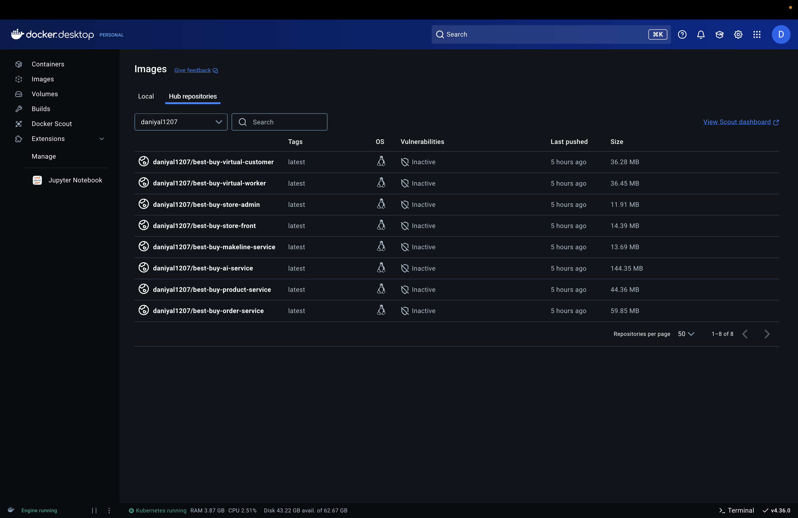
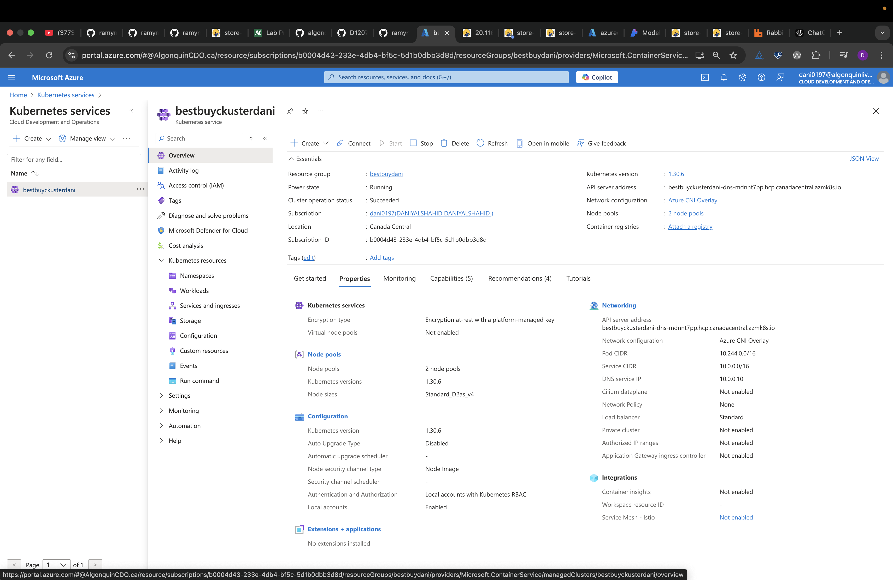
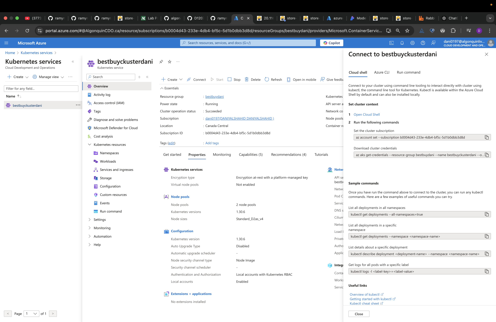
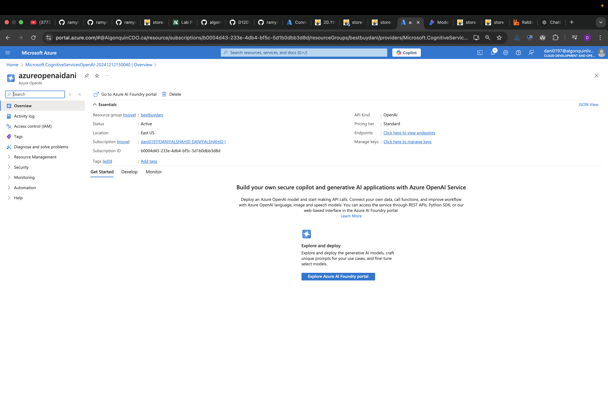
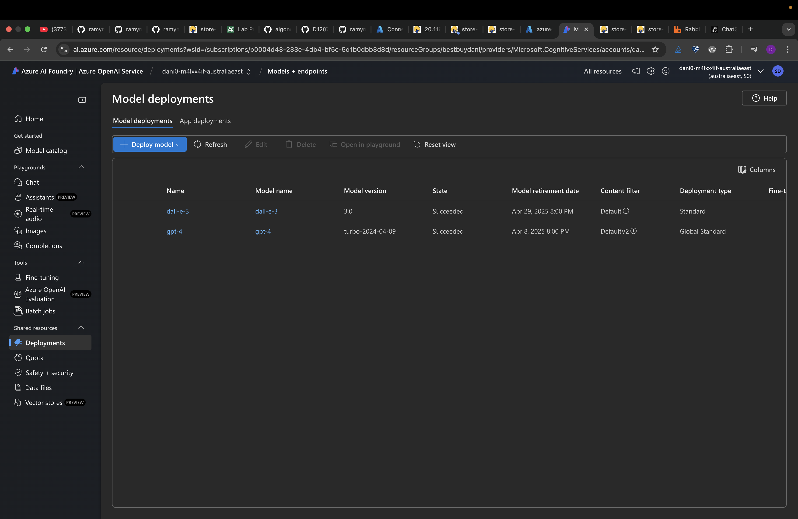
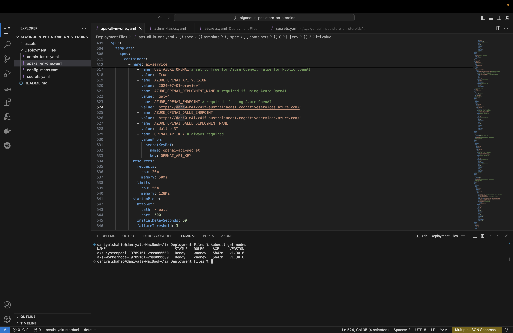
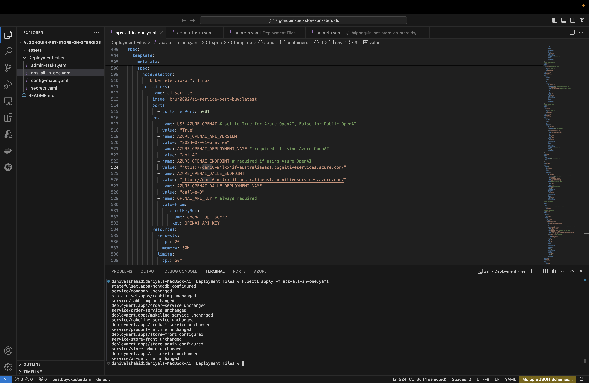
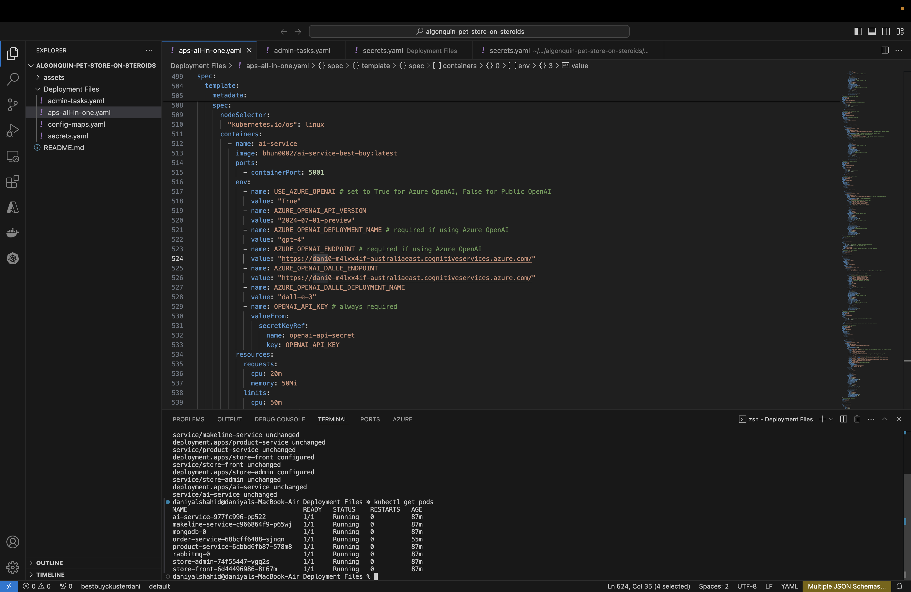
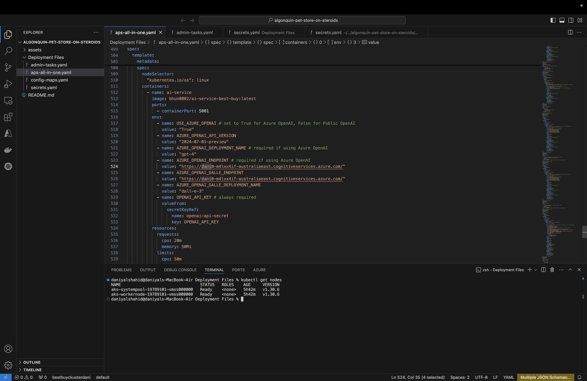
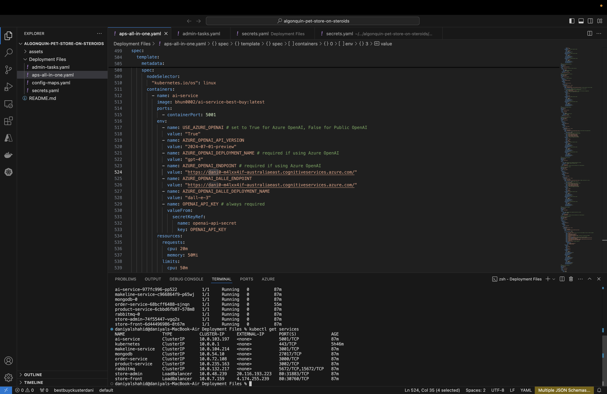

#  Assignment 2

# By Daniyal Shahid (041110791)
# Best Buy Cloud-Native Application

## **Introduction**

Welcome to the Best Buy Cloud-Native Application! This project outlines the design and deployment of a microservices-based architecture tailored for Best Buy’s e-commerce platform. It employs Kubernetes for container orchestration, Azure Service Bus for handling order queues, and Azure OpenAI for AI-driven functionalities.

---

## Step 1: Clone the BestBuyApplication Repository
Start by cloning the [**BestBuyApp**] repository, which contains all the required deployment files.

**Review the Deployment Files**:
   - Navigate to the `Deployment Files` folder.
   - This folder includes YAML files for deploying essential Kubernetes resources such as services, deployments, StatefulSets, ConfigMaps, and Secrets.

## **Revised Application Architecture**

### Architecture Overview

The application comprises the following services:

| Service              | Description                                                       | GitHub Repo         |
|----------------------|-------------------------------------------------------------------|---------------------|
| `store-front`        | Customer-facing web app for placing orders (Vue.js).             |https://github.com/D1207-D/final-best-buy-store-front               |
| `store-admin`        | Employee-facing app for order management (Vue.js).               |https://github.com/D1207-D/final-best-buy-store-admin                    |
| `order-service`      | Backend service for order placement (JavaScript).                |https://github.com/D1207-D/final-best-buy-order-service                     |
| `product-service`    | Handles CRUD operations on products (Rust).                      |https://github.com/D1207-D/final-best-buy-product-service                     |
| `makeline-service`   | Processes orders from the queue and completes them (Golang).     |https://github.com/D1207-D/final-best-buy-makeline-service                     |
| `ai-service`         | AI-powered service for product descriptions and images (Python). |https://github.com/D1207-D/final-best-buy-ai-service                     |
| `virtual-customer`   | Simulates customer order creation (Rust).                        |https://github.com/D1207-D/final-best-buy-virtual-customer                     |
| `virtual-worker`     | Simulates employee order processing (Rust).                      |https://github.com/D1207-D/final-best-buy-virtual-worker                     |


### **Service Descriptions**

| **Service**           | **Functionality**                                                   |
|-----------------------|-------------------------------------------------------------------|
| **Store-Front**       | A customer interface for browsing products and placing orders.   |
| **Store-Admin**       | An employee interface for managing inventory and orders.         |
| **Order-Service**     | Manages order creation and integrates with the queue.            |
| **Product-Service**   | Provides product management capabilities (CRUD).                 |
| **Makeline-Service**  | Reads from the queue to process and complete orders.             |
| **AI-Service**        | Generates product descriptions and images using Azure OpenAI.    |
| **Database**          | MongoDB for storing product and order data.                      |
| **Azure Service Bus** | Reliable message queuing for order management.                   |


### **Architecture Diagram**


## **Microservices and Docker Images**

## Testing Docker
### **Step 1: Build Docker Images for All Repositories**

```bash
docker build -t bestbuy-ai-service:latest .  
docker build -t bestbuy-makeline-service:latest .  
docker build -t bestbuy-product-service:latest .  
docker build -t bestbuy-store-front:latest .  
docker build -t bestbuy-virtual-worker:latest .  
docker build -t bestbuy-order-service:latest .  
docker build -t bestbuy-store-admin:latest .  
docker build -t bestbuy-virtual-customer:latest .
```
```bash

Step 2: Tag Docker Images
docker tag best-buy-ai-service:latest daniyal1207/best-buy-ai-service:latest  
docker tag best-buy-makeline-service:latest daniyal1207/best-buy-makeline-service:latest  
docker tag best-buy-product-service:latest daniyal1207/best-buy-product-service:latest  
docker tag best-buy-store-front:latest daniyal1207/best-buy-store-front:latest  
docker tag best-buy-virtual-worker:latest daniyal1207/best-buy-virtual-worker:latest  
docker tag best-buy-order-service:latest daniyal1207/best-buy-order-service:latest  
docker tag best-buy-store-admin:latest daniyal1207/best-buy-store-admin:latest  
docker tag best-buy-virtual-customer:latest daniyal1207/best-buy-virtual-customer:latest

```
```bash

## Step 3: Push Docker Images to the Repository
docker push daniyal1207/best-buy-ai-service:latest  
docker push daniyal1207/best-buy-makeline-service:latest  
docker push daniyal1207/best-buy-product-service:latest  
docker push daniyal1207/best-buy-store-front:latest  
docker push daniyal1207/best-buy-virtual-worker:latest  
docker push daniyal1207/best-buy-order-service:latest  
docker push daniyal1207/best-buy-store-admin:latest  
docker push daniyal1207/best-buy-virtual-customer:latest  

```


| **Service**          | **Docker Image Link**      | 
|----------------------|----------------------------|
| **Store-Front**      | https://hub.docker.com/r/daniyal1207/best-buy-store-front/tags | 
| **Order-Service**    |  https://hub.docker.com/r/daniyal1207/best-buy-order-service/tags| 
| **Product-Service**  |  https://hub.docker.com/r/daniyal1207/best-buy-product-service/tags| 
| **Makeline-Service** | https://hub.docker.com/r/daniyal1207/best-buy-makeline-service/tags |
| **Store-admin**      | https://hub.docker.com/r/daniyal1207/best-buy-store-admin/tags | 
| **AI-Service**       | https://hub.docker.com/r/daniyal1207/best-buy-ai-service/tags |
| **Virtual-Customer** | https://hub.docker.com/r/daniyal1207/best-buy-virtual-customer/tags | 
| **Virtual-Worker**   | https://hub.docker.com/r/daniyal1207/best-buy-virtual-worker/tags | 




---


## Step 2: Create an Azure Kubernetes Cluster (AKS)

### Steps to Set Up AKS:

1. **Log in to Azure Portal:**
   - Visit [https://portal.azure.com](https://portal.azure.com) and sign in.

2. **Create a Resource Group:**
   - Navigate to **Resource Groups** and create a new group:
     - Name: `bestbuydani`
     - Region: `Canada`

3. **Create an AKS Cluster:**
   - Go to **Kubernetes Services** and select **Create Kubernetes Cluster**.
   - Fill in the details:
     - **Cluster Name:** `bestbuyclusterdani`
     - **Region:** Same as the resource group.
     - **Node Pools:** Create one pool for control plane and another for worker nodes.
       - Control Plane: `1 Node` of size `D2as_v4`.
       - Worker Nodes: `2 Nodes` of size `D2as_v4`.

4. **Connect to the AKS Cluster:**
   - Use Azure CLI to authenticate and configure access to your cluster:
     ```bash
     az login
     az aks get-credentials --resource-group bestbuydani --name bestbuyclusterdani
     ```
   - Verify the connection:
     ```bash
     kubectl get nodes
     ```





---

## Step 3: Set Up AI Backing Services 

### Create and Configure Azure OpenAI Services:

1. **Create an Azure OpenAI Instance:**
   - Deploy the service in the `East US` region to access GPT-4 and DALL-E models.

2. **Deploy AI Models:**
   - Add GPT-4 and DALL-E 3 to the deployment.
   - Note the deployment names and endpoint URLs for later configuration.






3. **Retrieve API Keys:**
   - Access the **Keys and Endpoints** section in the Azure portal and copy the API key.
   - Base64 encode the API key:
     ```bash
     echo -n "<your-api-key>" | base64
     ```


4. **Update Configuration Files:**
   - Edit `secrets.yaml` and `aps-all-in-one.yaml` to include the encoded API key and endpoint details.

---

## Step 4: Deploy Application Components

1. **Deploy ConfigMaps and Secrets:**
   - Apply the configurations:
     ```bash
     kubectl apply -f config-maps.yaml
     kubectl apply -f secrets.yaml
     ```

2. **Deploy the Application:**
   - Deploy all services:
     ```bash
     kubectl apply -f aps-all-in-one.yaml
     ```


 
    
   - Validate the deployment:
     ```bash
     kubectl get pods
     kubectl get services
     ```
     






3. **Deploy Virtual Customer and Worker:**
   - Simulate order creation and processing:
     ```bash
     kubectl apply -f admin-tasks.yaml
     ```

---

## Step 5: Scale and Monitor Services

1. **Scale Deployments:**
   - Increase replicas of `order-service`:
     ```bash
     kubectl scale deployment order-service --replicas=3
     ```

2. **Monitor Resource Usage:**
   - Enable metrics and monitor usage:
     ```bash
     kubectl top pods
     kubectl top nodes
     ```

---

## Step 6: Test Advanced Features

### AI-Driven Product Enhancements:
- Use the AI service to generate dynamic product descriptions and images.

### RabbitMQ Management:
- Access the RabbitMQ UI:
  ```bash
  kubectl port-forward service/rabbitmq 15672:15672
  ```

### MongoDB Shell Access:
- Connect to MongoDB and query order data:
  ```bash
  kubectl exec -it <mongodb-pod-name> -- mongo
  use orderdb
  db.orders.find()
  ```
---

## **Demo Video**

- [Demo Video Link](youtube-link)

